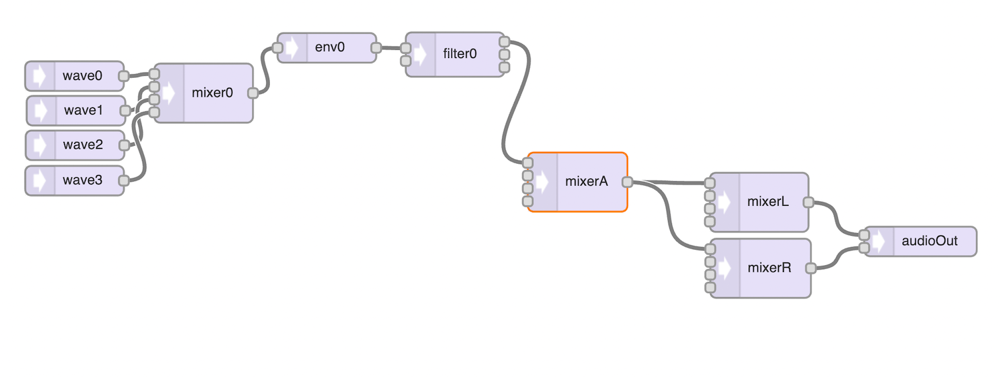
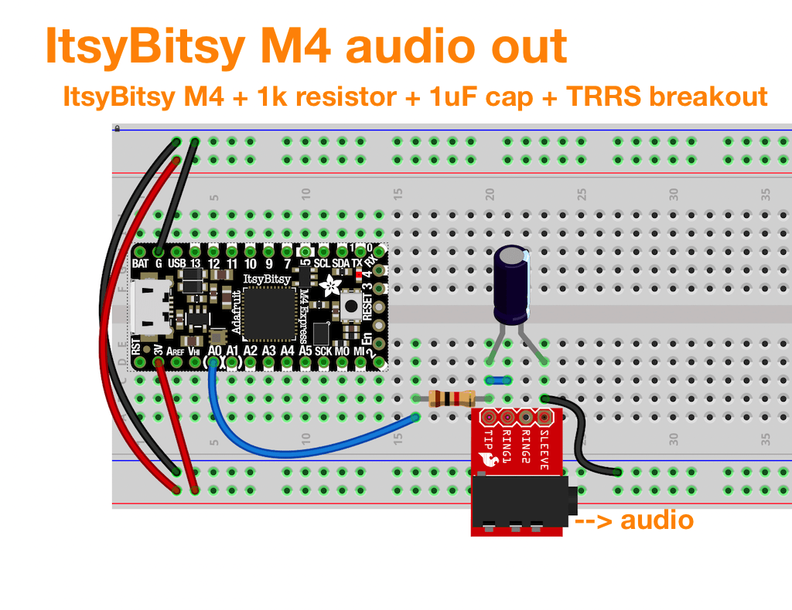

# tal_experiments

Experiments with the [Teensy Audio Library](https://www.pjrc.com/teensy/td_libs_Audio.html).

Mostly on SAMD51 (M4) boards using the
[Adafruit fork of Teensy Audio Library](https://github.com/adafruit/Audio).

### Demos

- ["ominous_foreboding.ino"](./ominous_foreboding/ominous_foreboding.ino) - a sign of things to come

  - [Demo video here](https://twitter.com/todbot/status/1479262437249413121)

  - Synth architecture:
    

### Audio circuit for ItsyBitsy M4

### Installing & Using Teensy Audio Library for SAMD51 (M4)

- In Arduino Library Manager, search for "Audio Adafruit Fork" and install the result
- Most Teensy examples will work, except:
-- The only supported Output I've tested is "

